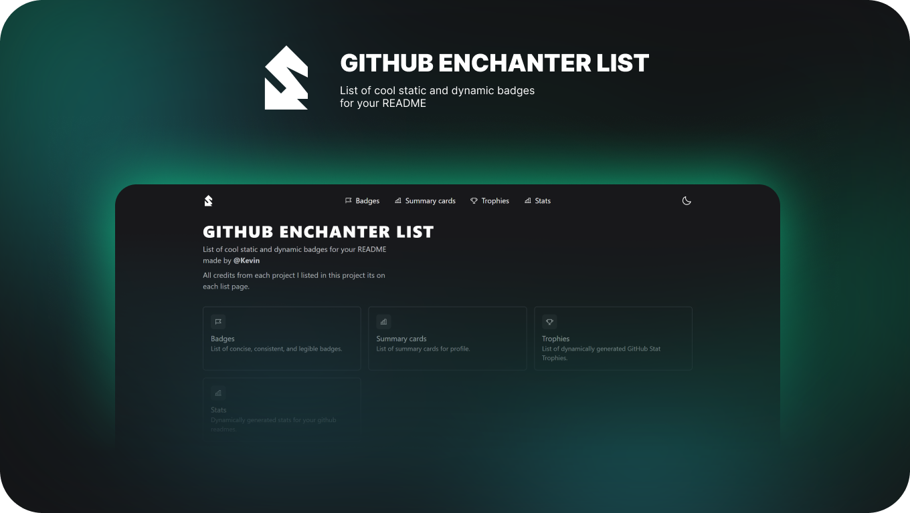

<p align="center">
	
   <h1 align="center">Github enchanter list</h3>
</p>

<p align="center"> List of cool static and dynamic badges for your README.
    <br>
</p>

---

<p align="center">
 <a href="#about">About</a> •
 <a href="#started">Getting started</a> •
 <a href="#built_using">Technologies</a> •
 <a href="#authors">Authors</a> •
 <a href="#acknowledgement">Acknowledgements</a>
</p>

---

## 🧐 About <a name="about"><a/>

### 🧠 Problem Statement <a name = "problem_statement"></a>

Most of all repository badge list was already preset with a default styling and didn't give the user the ability to customize freely.

### 💡 Idea / Solution <a name = "idea"></a>

To solve this problem, the website I created shows all the badges in real-time with a configuration section, so users can have fast visual feedback while customizing.

Using mainly the technologies Next.JS and Tailwind.css for the project, I'm incredibly thankful for all of the libraries creators I used on this project, like Zustand for storing states, RadixUI for accessible components, superjson for easy communication between client side and server side, fuzzysort to search on lists, SWR for fast fetching and infinity scrolling support along react-infinite-scroll-component.

<div align="center">
	
</div>

## 🏁 Getting Started <a name = "started"></a>

### 🎐 Prerequisites

Prerequisites for this project are:

- Node.js version 12.22.0 or later
- MacOS, Windows (including WSL), and Linux are supported

### ✨ Installing

A step-by-step to install and run the project locally.

1. Clone the project using the following command or install the zip:

```
git clone https://github.com/Hiyudev/github-enchanter-list.git
```

2. Install all the dependencies:

```
yarn install
```

3. Run the project:

```
yarn start
```

4. Open `http://localhost:3000` in the browser

## ⚙ Built with <a name = "built_using"></a>

### Technologies


### Tools


## ✍️ Authors <a name = "authors"></a>

- [@Hiyudev](https://github.com/Hiyudev) - Creator of this project

## 🎉 Acknowledgements <a name = "acknowledgement"></a>

- [@Shields.io](https://github.com/badges) - For the awesome badges
- [@Simple Icons](https://github.com/simple-icons) - For the awesome icons
- [@Casper](https://github.com/vn7n24fzkq) - For the awesome summary cards
- [@ryo-ma](https://github.com/ryo-ma) - For the awesome github trophies
- [@Anurag Hazra](https://github.com/anuraghazra) - For the awesome github stat cards
- [@Jonah Lawrence](https://github.com/DenverCoder1) - For the awesome github streak cards

## © License

- MIT License
